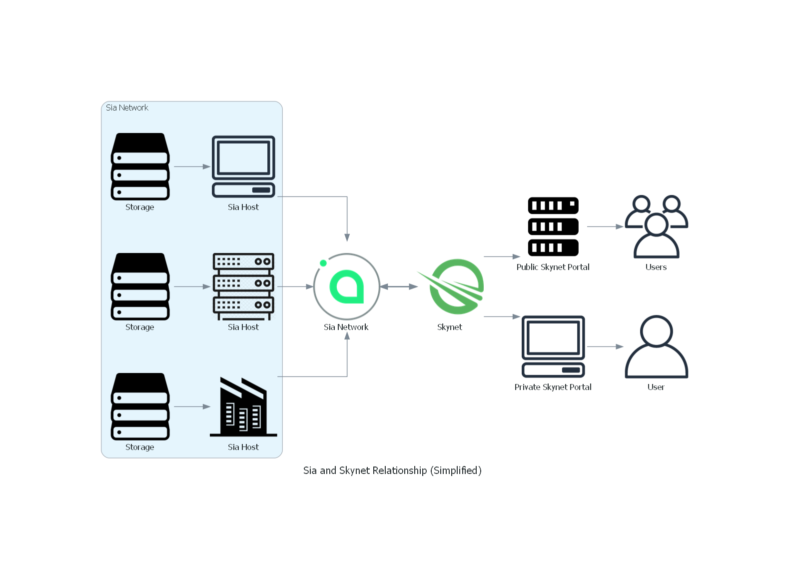

# Outline for General Documentation

## Welcome to Skynet

Here I imagine a high-level overview, hopefully with diagrams that show what skynet is and what it brings to content hosted on the platform. Very marketing/high-level.

### Basics and early pointer outwards to people that just want to "use" skynet

You don't need to know anything about webservers, DNS or blockchain to use the apps that our developers have built! This primer will be enough before linking to a User Guide.

#### You Can Use These Apps!

Skynet Apps Store, skyfeed, dropbox style, maybe the russian screenshot one.

#### What's the appeal of using Skynet apps over others?

Introduce idea of data being your own, immutable skylinks, censorship resistance.

#### What's a portal? Why paid accounts? Do I need one?

Really brief explanation before linking out to the User Guide which will provide walkthrough of making a Sky ID, interacting with another skapp and hopefully then taking that data and accessing it with another skapp.

## How Skynet Works

### Skynet and Sia

Address barebones of Sia, and point to where to read more.

Define idea of Renters and Hosts, "smart contract" and how SiaCoin is used for transferring value \(utility token vs store of value\)

How Skynet relies on Sia, view as "Layer2"

Portals "rent" storage from hosts \(and foot the bill\), but also allow users to access these files using a web browser. In fact, they let users access any file uploaded to through any portal. This is a key idea of data ownership.


I like the idea of using callouts or blockquotes as a way of emphasizing our philosophy just as much as out tech processes. The two are intertwined.


### Skynet Apps \(aka Skapps\)

Skynet really comes to life as developers build applications that not only use skynet for data storage, but live on skynet themselves. \(Why skapps are important! Users control data, data interoperability, open code\).

## Why does it matter?


This may be a good place to kick folks to David's getting started handbook?


## Developing on Skynet

Brief description of architecture, the SDKs, and a link to the "getting started guide" and perhaps the SDK docs.

## Running a Portal

The Skynet infrastructure continues to quickly evolve as we add additional features and improvements. We don't have a user-friendly guide available at this point, but if you're familiar with Docker, you can follow the instructions in the Skynet Web Portal repo. Additionally, a community member has created this video guide, which, although dated, should give you a sense of what it takes to run a portal.

We do not currently recommend that users without significant experience try to run or operate public portals.

Portal diversity is key for the decentralization of Skynet, and we plan to greatly simplify running a portal as Skynet evolves.

## Glossary

Portal, pinning, host, renter, siacoin, public portal, 

## FAQ

## 

